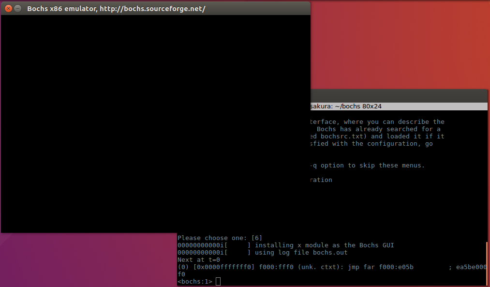
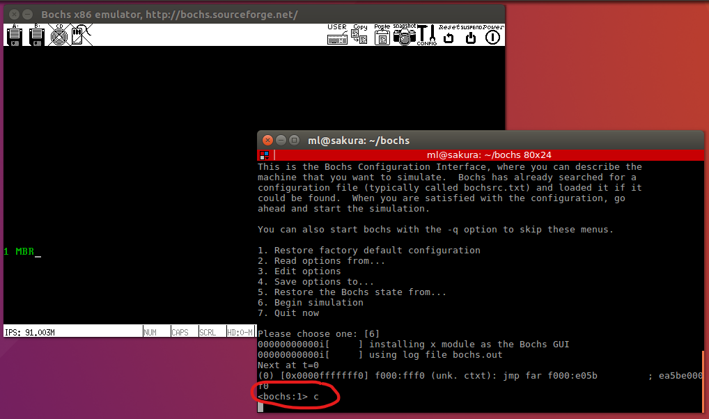

# MBR

主引导记录（主引导扇区）

## 代码

```assembly
; 主引导程序
;-----------------------------------------------------
SECTION MBR vstart=0x7c00 ; 起始地址编译为 0x7c00
    mov ax,cs   ; ax为通用寄存器,ds/es/fs/gs为段寄存器
    mov ds,ax   ; CPU 不能直接从立即数到段寄存器，需要通过其他寄存器中转
    mov es,ax   ; 这里使用 ax 转化
    mov ss,ax
    mov fs,ax
    mov sp,0x7c00 ; 初始化栈指针（栈是向低地址生长的），0x7c00 向上是MBR的代码，向下为可使用的安全区域，作为栈使用

; 清屏 : 利用 0x06 号功能，上卷全部行，则可清屏
;-----------------------------------------------------
; INT 0x10  功能号:0x06  功能描述 : 上卷窗口
;-----------------------------------------------------
; 输入 : 
; AH    功能号 = 0x06
; AL    =   上卷的行数（如果为0，表示全部）
; BH    =   上卷行属性
; (CL,CH) = 窗口左上角的 (X,Y)位置
; (DL,DH) = 窗口右下角的 (X,Y)位置
; 无返回值:
    mov ax, 0x600
    mov bx, 0x700
    mov cx, 0       ; 左上角 : (0, 0)
    mov dx, 0x184f  ; 右下角 : (80, 25)
                    ; VGA 文本模式下，一行只能容纳 80 个字符，共 25 行
                    ; 下标从 0 开始，故 0x18=24, 0x4f=79
    int 0x10        ;int 0x10

;-----------------------------------------------------
; 获取光标位置
; .get_cursor 获取当前光标位置，在光标位置处打印字符
;-----------------------------------------------------
    mov ah, 3       ; 输入 : 3号子功能是获取光标位置，需要存入 ah 寄存器
    mov bh, 0       ; bh 寄存器存储的是待获取光标的页号

    int 0x10        ; 输出 : ch=光标开始行，cl=光标结束行
                    ; dh=光标所在行号，dl=光标所在列号

;-----------------------------------------------------
; 打印字符串
; 0x10h 中断，调用 13 号子功能打印字符串
;-----------------------------------------------------
    mov ax, message
    mov bp, ax      ; es:bp 为串首地址，es此时与cs一致
                    ; 开头时已经为 sreg 初始化

    mov cx, 5       ; 光标位置要用到 dx 的内容，cx中的光标位置可忽略
                    ; cx 为串长度，不包括结束符 0 的字符个数
    mov ax, 0x1301  ; 子功能号 13 显示字符及属性，要存入 ah 寄存器
                    ; al 设置写字符方式 ah=01 ：显示字符串，光标跟随移动
    mov bx, 0x2     ; bh 存储要显示的页号，此处是第 0 页
                    ; bl 中是字符属性，属性黑底绿字（bl=02h）
    int 0x10        ; 执行 BIOS 0x10 号中断

;-----------------------------------------------------
; 死循环使得程序停在此处
;-----------------------------------------------------
    jmp $

;-----------------------------------------------------
; 定义字符串
;-----------------------------------------------------
    message db  "1 MBR"
;-----------------------------------------------------
; 字符填充
; 510 字节减去上面通过($-$$)得到的偏移量，其结果便是本扇区
; 内的剩余量，也就是要填充的字节数。
;-----------------------------------------------------
    times 510-($-$$) db 0
;-----------------------------------------------------
; 保证最后两个字节为 0x55, 0xaa
;-----------------------------------------------------
    db 0x55,0xaa
```

使用 `nasm -o mbr.bin mbr.S` 编译，可以再使用 `ls` 查看一下生成的 mbr.bin 的大小。

使用 `dd if=/home/ml/bochs/mbr.bin of=/home/ml/bochs/hd60M.img bs=512 count=1 conv=notrunc` 将其写入到0盘0道1扇区，成功则显示如下输出：

```shell
$ dd if=/home/ml/bochs/mbr.bin of=/home/ml/bochs/hd60M.img bs=512 count=1 conv=notrunc
1+0 records in
1+0 records out
512 bytes copied, 0.000219607 s, 2.3 MB/s
```

## dd

```shell
if=FILE
read from FILE instead of stdin
此项是指定要读取的文件。
of=FILE
write to FILE instead of stdout
此项是指定把数据输出到哪个文件。
bs=BYTES
read and write BYTES bytes at a time (also see ibs ＝，。bs=)
此项指定块的大小， dd 是以块为单位来进行IO 操作的，得告诉人家块是多大字节。此项是统计配置
了输入块大小ibs 和输出块大小obs 。这两个可以单独配置。
count=BLOCKS
copy only BLOCKS input blocks
此项是指定拷贝的块数。
seek= BLOCKS
skip BLOCKS obs-sized blocks at start of output
此项是指定当我们把块输出到文件时想要跳过多少个块。
conv=CONVS
convert the file as per the - comma separated symbol list
此项是指定如何转换文件。
append append mode (makes sense only for output; conv=notrunc sugges.ted)
这句话建议在追加数据时， conv 最好用notrunc 方式，也就是不打断文件。
齐了， dd 的介绍就到这了，赶紧试验一下这个神奇的工具吧。
```


## 运行 bochs 

写入完成后，切换到 bochs 安装路径下，输入 `bin/bochs -f bochsrc.disk` 回车，显示如下内容：

```shell
bin/bochs -f bochsrc.disk
========================================================================
                       Bochs x86 Emulator 2.6.2
                Built from SVN snapshot on May 26, 2013
                  Compiled on Oct 24 2022 at 21:06:44
========================================================================
00000000000i[     ] reading configuration from bochsrc.disk
00000000000e[     ] bochsrc.disk:29: 'keyboard_mapping' will be replaced by new 'keyboard' option.
------------------------------
Bochs Configuration: Main Menu
------------------------------

This is the Bochs Configuration Interface, where you can describe the
machine that you want to simulate.  Bochs has already searched for a
configuration file (typically called bochsrc.txt) and loaded it if it
could be found.  When you are satisfied with the configuration, go
ahead and start the simulation.

You can also start bochs with the -q option to skip these menus.

1. Restore factory default configuration
2. Read options from...
3. Edit options
4. Save options to...
5. Restore the Bochs state from...
6. Begin simulation
7. Quit now

Please choose one: [6] 
```

默认 [6]，开始模拟，回车，出现以下界面：



因为我们编译的是可调试版本，所以会停在这，bochs 正在等待我们键入下一步命令。前面显示的黑框即为 bochs 模拟的机器，他就是台电脑也是显示器。原本输入 shell 命令的终端，现在就是 bochs 的控制台，我们输入的命令都写在这里。接着，输入字符 `c` 并回车，bochs 控制台就会被激活。

- c 表示 continue，调试方法与 gdb 类似；
- 在 bochs 控制台的程序运行中，使用 `ctrl + c` 终止程序；
- 在 `<bochs:1>` 的 bochs 命令行下，使用 `ctrl + d` 终止 bochs；

运行起来后，就能看到 `1 mbr` 字符以黑底绿字显示在模拟器上。



## 小端存储

低字节在低位,大端则相反

## ndisasm

反汇编工具

## xxd

逐字节查看文件

### 脚本

```sh
#usage: sh xxd.sh 文件起始地址长度
xxd -u -a -g 1 -s $2 -1 $3 $1
#-u use upper cas.e hex letters. Default is lower case.
#
#-a | -autoskIP
# toggle autoskIP: A single ’*’ replaces nul-lines. Default off.
#
#-g bytes | -groupsize bytes
# separate the output of every <bytes> bytes (two hex characters or eight bit-digits each) by a whitespace. Specify -g 0 to
# suppress grouping. <Bytes> defaults to 2 in normal mode and 1 in bi ts mode. Grouping does not apply to postscrIPt or
# include style.
#
#-c cols I -cols cols
# format <cols> octets per line. Default 16 (-i: 12, -ps: 30, -b: 6). Max 256.
#
#-s [+][-]seek
# start at <seek> bytes abs. (or re.l.) infile offset. + indicates that the seek is relative to the current stdin file position
# (meaningless when not reading from stdin) . - indicates that the seek should be that many characters from the end of
# the input (or if combined with +: before the current stdin file position).
# Without -s option, xxd starts at the current file position.
```

### 示例

保存为 `call.S` , 编译生成 `call.bin`.

```assembly
call near near_proc ; 3个字节
jmp $ ; 2个字节
addr dd 4 ; 4字节变量
near_proc: 
    mov ax, 0x1234
    ret
```

`ll -b call.bin` 查看文件大小:

```shell
$ ll -b 1call.bin 
-rw-rw-r-- 1 ml ml 13 10月 25 16:20 call.bin
```

然后 `sh xxd.sh call.bin 0 13` 查看二进制文件内容:

```shell
$ sh xxd.sh call.bin 0 13
00000000: E8 06 00 EB FE 04 00 00 00 B8 34 12 C3           ..........4..
```


## 改进 MBR 直接操作显卡

```assembly
; 主引导程序
; LOADER_BASE_ADDR equ 0xA000
; LOADER_START_SECTOR equ 0x2
;-----------------------------------------------------
SECTION MBR vstart=0x7c00 ; 起始地址编译为 0x7c00
    mov ax,cs   ; ax为通用寄存器,ds/es/fs/gs为段寄存器
    mov ds,ax   ; CPU 不能直接从立即数到段寄存器，需要通过其他寄存器中转
    mov es,ax   ; 这里使用 ax 转化
    mov ss,ax
    mov fs,ax
    mov sp,0x7c00 ; 初始化栈指针（栈是向低地址生长的），0x7c00 向上是MBR的代码，向下为可使用的安全区域，作为栈使用
    mov ax,0xb800
    mov gs,ax

; 清屏 : 利用 0x06 号功能，上卷全部行，则可清屏
;-----------------------------------------------------
; INT 0x10  功能号:0x06  功能描述 : 上卷窗口
;-----------------------------------------------------
; 输入 : 
; AH    功能号 = 0x06
; AL    =   上卷的行数（如果为0，表示全部）
; BH    =   上卷行属性
; (CL,CH) = 窗口左上角的 (X,Y)位置
; (DL,DH) = 窗口右下角的 (X,Y)位置
; 无返回值:
    mov ax, 0600h
    mov bx, 0700h
    mov cx, 0       ; 左上角 : (0, 0)
    mov dx, 184fh  	; 右下角 : (80, 25)
                    ; VGA 文本模式下，一行只能容纳 80 个字符，共 25 行
                    ; 下标从 0 开始，故 0x18=24, 0x4f=79
    int 10h         ; int 0x10

;-----------------------------------------------------
; 输出绿底红字，且跳动的字符串 "1 MBR"
;-----------------------------------------------------
    mov byte [gs:0x00],'1'
    mov byte [gs:0x01],'0xA4' 
    ; 0xA4 即为 1010 0100 
    ; 第一个1表示闪烁，第2个表示绿背景，第三个表示红字
    mov byte [gs:0x02],' '
    mov byte [gs:0x03],'0xA4' 
    
    mov byte [gs:0x04],'M'
    mov byte [gs:0x05],'0xA4' 
    
    mov byte [gs:0x06],'B'
    mov byte [gs:0x07],'0xA4' 
    
    mov byte [gs:0x08],'R'
    mov byte [gs:0x09],'0xA4' 

;-----------------------------------------------------
; 死循环使得程序停在此处
;-----------------------------------------------------
    jmp $
;-----------------------------------------------------
; 字符填充
; 510 字节减去上面通过($-$$)得到的偏移量，其结果便是本扇区
; 内的剩余量，也就是要填充的字节数。
;-----------------------------------------------------
    times 510-($-$$) db 0
;-----------------------------------------------------
; 保证最后两个字节为 0x55, 0xaa
;-----------------------------------------------------
    db 0x55,0xaa
```

文字没有闪烁，其他的正常。

## Reference 

1. 
