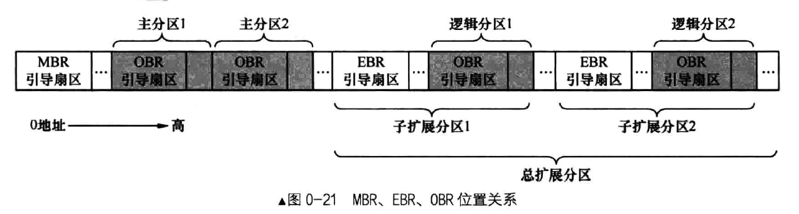

# Hardware Drive

## 创建从盘并获取安装的磁盘数

使用 xp 探测 0x475 ，该位置存储了磁盘的数量，由 bios 写入

目前只有主盘 hd60M.img

```
<bochs:2> xp/b 0x75
[bochs]:
0x00000475 <bogus+       0>:	0x01
```

/bin/bximage 工具创建从盘 hd80M.img 

```
ml@sakura:~/bochs$ ./bin/bximage 
========================================================================
                                bximage
                  Disk Image Creation Tool for Bochs
          $Id: bximage.c 11315 2012-08-05 18:13:38Z vruppert $
========================================================================

Do you want to create a floppy disk image or a hard disk image?
Please type hd or fd. [hd] 

What kind of image should I create?
Please type flat, sparse or growing. [flat] 

Enter the hard disk size in megabytes, between 1 and 8257535
[10] 80 # 磁盘大小 MB

I will create a 'flat' hard disk image with
  cyl=162 # 柱面数
  heads=16 # 磁头数
  sectors per track=63 # 每磁道扇区
  total sectors=163296 # 总扇区数
  total size=79.73 megabytes # 实际大小（MB）

What should I name the image?
[c.img] hd80.img # 磁盘映像名称

Writing: [] Done.

I wrote 83607552 bytes to hd80.img.

# 将以下内容写入 bochs 配置
# 由于这一块为从盘，需要将 ata0-matser 改为 ata0-slave
The following line should appear in your bochsrc:
  ata0-master: type=disk, path="hd80.img", mode=flat, cylinders=162, heads=16, spt=63
```

再次检测磁盘数

```
<bochs:3> xp/b 0x475
[bochs]:
0x00000475 <bogus+       0>:	0x02

```

## 创建磁盘分区表

硬盘容量 = 每磁道扇区数 X 磁道数（柱面数） X 512 X 磁头数

则 磁道数（柱面数） X 磁头数 = 硬盘容量 / 每磁道扇区数 / 512

```
$ fdisk hd80M.img

Welcome to fdisk (util-linux 2.27.1).
Changes will remain in memory only, until you decide to write them.
Be careful before using the write command.


Command (m for help): m

Help:

  DOS (MBR)
   a   toggle a bootable flag
   b   edit nested BSD disklabel
   c   toggle the dos compatibility flag

  Generic
   d   delete a partition
   F   list free unpartitioned space
   l   list known partition types
   n   add a new partition
   p   print the partition table
   t   change a partition type
   v   verify the partition table
   i   print information about a partition

  Misc
   m   print this menu
   u   change display/entry units
   x   extra functionality (experts only)

  Script
   I   load disk layout from sfdisk script file
   O   dump disk layout to sfdisk script file

  Save & Exit
   w   write table to disk and exit
   q   quit without saving changes

  Create a new label
   g   create a new empty GPT partition table
   G   create a new empty SGI (IRIX) partition table
   o   create a new empty DOS partition table
   s   create a new empty Sun partition table

# 切换为 cylinders 为单位分配
Command (m for help): u
Changing display/entry units to cylinders (DEPRECATED!).

# 设置柱面数和磁头数
Command (m for help): x

Expert command (m for help): m

Help (expert commands):

  DOS (MBR)
   b   move beginning of data in a partition
   i   change the disk identifier

  Geometry
   c   change number of cylinders
   h   change number of heads
   s   change number of sectors/track

  Generic
   p   print the partition table
   v   verify the partition table
   d   print the raw data of the first sector from the device
   D   print the raw data of the disklabel from the device
   f   fix partitions order
   m   print this menu

  Save & Exit
   q   quit without saving changes
   r   return to main menu


Expert command (m for help): c
Number of cylinders (1-1048576, default 10): 162

Expert command (m for help): h
Number of heads (1-256, default 255): 16

# 返回上一级主菜单
Expert command (m for help): r

# 创建主分区 1
Command (m for help): n
Partition type
   p   primary (0 primary, 0 extended, 4 free)
   e   extended (container for logical partitions)
Select (default p): p
Partition number (1-4, default 1): 
First cylinder (3-162, default 3): 
Last cylinder, +cylinders or +size{K,M,G,T,P} (3-162, default 162): 32

Created a new partition 1 of type 'Linux' and of size 14.8 MiB.

# 创建扩展分区
# 全部默认，剩下的全部为扩展分区
Command (m for help): n
Partition type
   p   primary (1 primary, 0 extended, 3 free)
   e   extended (container for logical partitions)
Select (default p): e
Partition number (2-4, default 2): 
First cylinder (33-162, default 33): 
Last cylinder, +cylinders or +size{K,M,G,T,P} (33-162, default 162): 

Created a new partition 2 of type 'Extended' and of size 64 MiB.

# 创建逻辑分区
Command (m for help): n
All space for primary partitions is in use.
Adding logical partition 5
First cylinder (37-162, default 37): 
Last cylinder, +cylinders or +size{K,M,G,T,P} (37-162, default 162): +23

Created a new partition 5 of type 'Linux' and of size 11.8 MiB.

Command (m for help): n
All space for primary partitions is in use.
Adding logical partition 6
First cylinder (63-162, default 63): 
Last cylinder, +cylinders or +size{K,M,G,T,P} (63-162, default 162): +23

Created a new partition 6 of type 'Linux' and of size 11.8 MiB.

Command (m for help): n
All space for primary partitions is in use.
Adding logical partition 7
First cylinder (89-162, default 90): 
Last cylinder, +cylinders or +size{K,M,G,T,P} (90-162, default 162): +23

Created a new partition 7 of type 'Linux' and of size 11.8 MiB.

Command (m for help): n
All space for primary partitions is in use.
Adding logical partition 8
First cylinder (89-162, default 116): 
Last cylinder, +cylinders or +size{K,M,G,T,P} (116-162, default 162): +23

Created a new partition 8 of type 'Linux' and of size 11.8 MiB.

Command (m for help): n
All space for primary partitions is in use.
Adding logical partition 9
First cylinder (89-162, default 143): 
Last cylinder, +cylinders or +size{K,M,G,T,P} (143-162, default 162): 

Created a new partition 9 of type 'Linux' and of size 9.9 MiB.

Command (m for help): p
Disk hd80M.img: 79.8 MiB, 83607552 bytes, 163296 sectors
Geometry: 16 heads, 63 sectors/track, 162 cylinders
Units: cylinders of 1008 * 512 = 516096 bytes
Sector size (logical/physical): 512 bytes / 512 bytes
I/O size (minimum/optimal): 512 bytes / 512 bytes
Disklabel type: dos
Disk identifier: 0xeb999082

Device     Boot Start   End Cylinders  Size Id Type
hd80M.img1          3    34        32 15.8M 83 Linux
hd80M.img2         35   162       129   63M  5 Extended
hd80M.img5         37    60        24 11.8M 83 Linux
hd80M.img6         63    86        24 11.8M 83 Linux
hd80M.img7         90   113        25 11.8M 83 Linux
hd80M.img8        116   139        24 11.8M 83 Linux
hd80M.img9        143   162        21  9.9M 83 Linux

Command (m for help): t
Partition number (1,2,5-9, default 9): 5
Partition type (type L to list all types): 0x66

Changed type of partition 'Linux' to 'unknown'.

Command (m for help): t
Partition number (1,2,5-9, default 9): 6
Partition type (type L to list all types): 0x66

Changed type of partition 'Linux' to 'unknown'.

Command (m for help): 7
7: unknown command

Command (m for help): t
Partition number (1,2,5-9, default 9): 7
Partition type (type L to list all types): 0x66

Changed type of partition 'Linux' to 'unknown'.

Command (m for help): t
Partition number (1,2,5-9, default 9): 8
Partition type (type L to list all types): 0x66

Changed type of partition 'Linux' to 'unknown'.

Command (m for help): t
Partition number (1,2,5-9, default 9): 9
Partition type (type L to list all types): 0x66

Changed type of partition 'Linux' to 'unknown'.

Command (m for help): p
Disk hd80M.img: 79.8 MiB, 83607552 bytes, 163296 sectors
Geometry: 16 heads, 63 sectors/track, 162 cylinders
Units: cylinders of 1008 * 512 = 516096 bytes
Sector size (logical/physical): 512 bytes / 512 bytes
I/O size (minimum/optimal): 512 bytes / 512 bytes
Disklabel type: dos
Disk identifier: 0xeb999082

Device     Boot Start   End Cylinders  Size Id Type
hd80M.img1          3    34        32 15.8M 83 Linux
hd80M.img2         35   162       129   63M  5 Extended
hd80M.img5         37    60        24 11.8M 66 unknown
hd80M.img6         63    86        24 11.8M 66 unknown
hd80M.img7         90   113        25 11.8M 66 unknown
hd80M.img8        116   139        24 11.8M 66 unknown
hd80M.img9        143   162        21  9.9M 66 unknown

Command (m for help): w
The partition table has been altered.
Syncing disks.

ml@sakura:~/bochs$ fdisk -l hd80M.img
Disk hd80M.img: 79.8 MiB, 83607552 bytes, 163296 sectors
Units: sectors of 1 * 512 = 512 bytes
Sector size (logical/physical): 512 bytes / 512 bytes
I/O size (minimum/optimal): 512 bytes / 512 bytes
Disklabel type: dos
Disk identifier: 0xeb999082

Device     Boot  Start    End Sectors  Size Id Type
hd80M.img1        2048  34271   32224 15.8M 83 Linux
hd80M.img2       34272 163295  129024   63M  5 Extended
hd80M.img5       36320  60479   24160 11.8M 66 unknown
hd80M.img6       62528  86687   24160 11.8M 66 unknown
hd80M.img7       89712 113903   24192 11.8M 66 unknown
hd80M.img8      115952 140111   24160 11.8M 66 unknown
hd80M.img9      143136 163295   20160  9.9M 66 unknown
```





## 硬盘驱动程序

打开 IRQ2 的中断


## Reference 

1. 
