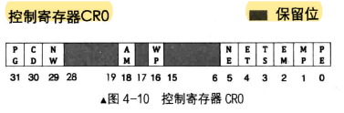
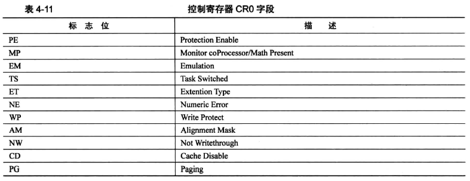
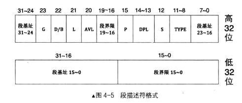
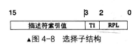

# 保护模式

## 实模式（Real Mode）的缺点

- 安全缺陷：
  1. 操作系统和用户程序属于同一级别，没有特权级别；
  2. 用户程序所引用的地址都是真实地址，逻辑地址等于物理地址；
  3. 用户程序可以自由的修改段基址，访问所有内存；
- 使用缺陷：
  1. 访问超过 64 KB 内存区域需要切换段基址；
  2. 一次只能运行一个程序，无法充分利用计算机资源；
  3. 共 20 条地址线，最大可用内存为 1 MB；

为了克服这一低劣的内存管理方式，保护模式应运而生。程序不能直接访问物理内存，程序使用的都是虚拟内存，需要通过内部转化为物理地址后访问，程序对此一无所知。地址转化的工作是由CPU和操作系统功能完成的，CPU在硬件上提供支持，操作系统提供转化所需要的**页表**。


## CPU 与外设 IO

### 从端口读数据

```assembly
in al, dx ; 8bit
in ax, dx ; 16bit
```

只要是 in 指令，源操作数必须是 dx 寄存器，dx 端口指代的寄存器是 8 位用 al，16 位用 ax。

### 向端口写数据

```assembly
out dx,al
out dx,ax
out 立即数,al
out 立即数,ax
```

out 指令中，dx 或立即数都可以充当端口号，端口为 8 位使用 al，端口为 16 位 使用 ax。

## 打开 A20 

将 端口 0x92 的第 1 位设置为 1 即可。

```assembly
in al,0x92
or al,0000_0010B
out 0x92,al
```

## 加载 GDT

```assembly
lgdt 48位内存数据
```

其中，48 位内存数据的前 16 位为 GDT 以字节为单位的界限值，也就是 GDT 大小 - 1。后 32 位是 GDT 的起始地址。

## 设置 CR0 寄存器的 PE 位

将寄存器的 PE 位设置为 1 即可，这一位为 Protection Enable ，用于启动保护模式，是保护模式的开关，是进入保护模式的最后一步。





```assembly
mov eax, cr0
or eax, 0x00000001
mov cr0, eax
```


## 段描述符格式

在保护模式下，为了兼容实模式下访问内存的形式——”段基址：段内偏移“和提高系统安全。CPU 工程师考虑为内存段添加安全属性，可安全属性应该存放在哪？显然寄存器是没有足够的空间存放这些内容的。除了寄存器，自然只剩下内存可以考虑。既然选择了内存，那完全可以添加更多的信息，而这些属性+内存段的基本信息即为**段描述符**。该结构共 8 个字节，以下是相关格式：



特别的，这里分为高 32 和 低 32 是方便展示，在内存中必须是连续的 8 字节。

**段界限**表示段内偏移的的最值，向高地址扩展，则表示段内偏移的最大值，向低地址扩展，则表示段内偏移的最小值。这里的段界限是一个单位量而非真实值，需配合高 32 位中的 G（23） 位理解。G 位定义了段界限的单位长度（或者叫段界限的粒度）：

- G 位为 0 ：段界限粒度大小为 1 字节；
- G 位为 1 ：段界限粒度大小为 4KB 字节；

实际的段界限值：(描述符中的段界限 + 1) * 段界限粒度大小 - 1 。

因为描述符中的段界限从 0 开始所以要 + 1，最后求得结果为最大值，而地址从 0 开始，所以再 - 1。如果是在平坦模型下，段界限为 0xFFFFF，G 位为 1 ，则实际得段界限值 = (0xFFFFF + 1) * 0x1000 - 1 = 0xFFFFFFFF。(4GB)  

段界限是用来限制段内偏移地址的，超过这个范围 CPU 会抛出异常，根据异常，我们需要编写响应的处理程序。

其中，低 32 位分为两部分，低 0~15 位用于存储段界限的前 0~15 位，后 16 位存储段基址的 0~15 位。

以下为段描述符高 32 位的相关内容：

- 

- 第 22 位是 D/B 字段，指示有效地址（段内偏移地址）及操作数大小。为兼容 286 存在的保护模式，286 的保护模式为 16 位。操作数与指令有关，指令与代码段和栈段有关：
  对于代码段，此位为 D ： D=0时，表示有效地址和操作数都是 16 位，有效地址使用 IP 寄存器。D=1时，表示有效地址和操作数都是 32 位，有效地址使用 EIP 寄存器。
  对于栈段，此位为 B ： B=0时，使用 sp 寄存器，栈起始地址为 16 位寄存器的最大寻址范围 0xFFFF。B=1时，使用 esp 寄存器，栈起始地址为 32 位寄存器的最大寻址范围 0xFFFFFFFF。

- 第 23 位是 G 字段，Granularity，粒度，指定段界限的单位大小。配合段界限使用，与段界限决定段的大小。G 为 0，段界限的单位为 1 字节，段最大为 2 的 20 次方 * 1 字节，即 1 MB。G 为 1，段界限的单位为 4KB 字节，段最大为 2 的 20 次方 * 4KB 字节，即 4 GB。

## 选择子（selector）

以下是选择子的结构及属性说明：

- RPL 请求特权级 (0~1)，两个字节表示 0、1、2、3；
- TI（Table Indicator）（2）：0 表示该值在 GDT 中索引描述符，1 表示该值在 LDT 中索引描述符。
- 描述符索引值 （3~15）：13 位，2 的 13 次方 8192，最多索引的段，与 GDT 最多定义 8192 个段吻合。这就是在 GDT 中的下标值，通过这个值在 GDT 中找到对应的段描述符，然后找到对应的段基址。




将 loader.S 需要用到的相关配置信息定义在 include/boot.inc 中，描述符中各个字段使用 equ 定义（<描述符名称> equ <表达式>），符号名统一采用 "DESC\_字段名\_字段相关信息" 的形式。

```assembly
; ----------------- loader & kernel ----------------- 
LOADER_BASE_ADDR equ 0x900
LOADER_START_SECTOR equ 0x2

; ----------------- gdt discriptor attributes ----------------- 
; Granularity(23) : if 1, unit is 4KB 
DESC_G_4K 			equ 	1000_0000_0000_0000_0000b 
; D/B(22) : if 1, 32 bit for offset & operating number
DESC_D_32 			equ 	100_0000_0000_0000_0000b
; L(21) : (reserved bit) if 0, don't set 64 bit code segment 
DESC_L				equ		00_0000_0000_0000_0000b
; AVaiLable(20) : no
DESC_AVL			equ		0_0000_0000_0000_0000b
; segment limit(16~19)
DESC_LIMIT_CODE2	equ		1111_0000_0000_0000b
DESC_LIMIT_DATA2	equ		DESC_LIMIT_CODE2
DESC_LIMIT_VIDEO2	equ		0000_0000_0000_0000b
; Present(15) : if segment in memory, set 1. or else set 0
DESC_P				equ		1000_0000_0000_0000b
; Descriptor Privilege Level(13~14) : CPU 0(high level), user 3 
DESC_DPL_0			equ		000_0000_0000_0000b
DESC_DPL_1			equ		010_0000_0000_0000b
DESC_DPL_2			equ		100_0000_0000_0000b
DESC_DPL_3			equ		110_0000_0000_0000b
; S(12) : if 0, system segment. if 1, data segement(code & data). 
DESC_S_CODE			equ		1_0000_0000_0000b
DESC_S_DATA			equ		DESC_S_CODE
DESC_S_sys			equ		0_0000_0000_0000b
; type(8~11) : with S
; EXecutable(11), Read(10), Conforming(9), Accessed(8)
; code : x=1,c=0,r=0,a=0 EXecutable, no read, no Conforming, no Accessed
DESC_TYPE_CODE		equ		1000_0000_0000b
; data : x=0,e=0,w=1,a=0 no EXecutable, extend to high addr, writeable, no Accessed
DESC_TYPE_DATA		equ		0010_0000_0000b

; code segment high 4 bytes 
DESC_CODE_HIGH4		equ		(0x00 << 24) \ 
							+ DESC_G_4K \
							+ DESC_D_32 \
							+ DESC_L \
                            + DESC_AVL \
                            + DESC_LIMIT_CODE2 \
                            + DESC_P \
                            + DESC_DPL_0 \
                            + DESC_S_CODE \
                            + DESC_TYPE_CODE
                            + 0x00
; data(stack) segment high 4 bytes 
DESC_DATA_HIGH4 	equ 	(0x00 << 24) \ 
							+ DESC_G_4K \
							+ DESC_D_32 \
							+ DESC_L \
                            + DESC_AVL \
                            + DESC_LIMIT_DATA2 \
                            + DESC_P \
                            + DESC_DPL_0 \
                            + DESC_S_DATA \
                            + DESC_TYPE_DATA
                            + 0x00

; video segment high 4 bytes 
DESC_VIDEO_HIGH4 	equ 	(0x00 << 24) \ 
							+ DESC_G_4K \
							+ DESC_D_32 \
							+ DESC_L \
                            + DESC_AVL \
                            + DESC_LIMIT_VIDEO2 \
                            + DESC_P \
                            + DESC_DPL_0 \
                            + DESC_S_DATA \
                            + DESC_TYPE_DATA
                            + 0x00
                            
; ----------------- selector attribute ----------------- 
; RPL (0~1) : 0、1、2、3
RPL0	equ		00b
RPL1	equ		01b
RPL2	equ		10b
RPL3	equ		11b
; Table Indicator (2): 0 GDT 1 LDT
TI_GDT	equ		000b
TI_LDT	equ		100b
```


全局描述符表 GDT 实质是一片内存区域，每一个表项称为段描述符，一个段描述符的大小为 8 字节，这里采用分别定义 2 个 4 字节的方式（事实上可以直接定义 8 个字节，或者定义 4 个 2 字节）。dd （define double-word）是伪指令，即定义双字变量，实模式下一个字 2 字节，故双字就是 4 字节。程序编译后的地址从上往下递增，故前 4 个字节为低字节，后 4 个字节为高字节。

构建全局描述符表，并直接填充段描述符。GDT_BASE 为 GDT 的起始地址，这里直接定义了 3 个段描述符：代码段描述符 CODE_DESC、数据段和栈段描述符 DATA_STACK_DESC、显存段描述符 VIDEO_DESC。其中 DESC 表示 descriptor 描述符。由于 GDT 的第 0 个描述符不可用，所以 GDT_BASE 后面紧跟的 2 个 4 字节置为 0 ，接着依次即为定义好的 3 个段描述符。

段描述符的低 4 字节中，低 2 字节为段界限的 0 ~ 15 位，高 2 字节位为段基址 0 ~ 15 位。由于我们采用的平坦模型，所以段基址均为 0，段界限均为 0xFFFFF。故 CODE_DESC 和 DATA_STACK_DESC 低 4 字节均为 0x0000FFFF。

```assembly
GDT_BASE: 
	dd 0x00000000 
	dd 0x00000000
CODE_DESC: 
	dd 0x0000FFFF 
	dd DESC_CODE_HIGH4
DATA_STACK_DESC: 
	dd 0x0000FFFF 
	dd DESC_DATA_HIGH4
VIDEO_DESC: 
	dd 0x80000007 ; limit = (0xbffff - 0xb8000) / 4k = 0x7
    dd DESC_VIDEO_HIGH4 ; dp1 = 0
```


## 获取物理内存容量


## Reference 

1. 
